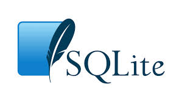
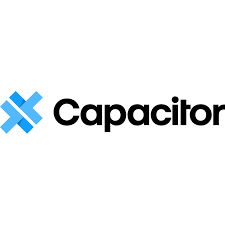

# Shopping List App

## Technology Used

	
	
	
	
	 
	
	
	
	
	 
	
	
	
	
	

## Content 

<table>
	<tr>
		<th>Topics</th>
		<th>Links</th>
	</tr>
	<tr>
		<td style='text-align: center;'>
			Intro
		</td>
		<td style='text-align: center;'>
			<a href="#Intro"> Link </a>
		</td>
	</tr>
	<tr>
		<td style='text-align: center;'>
			Features
		</td>
		<td style='text-align: center;'>
			<a href="#Features"> Link </a>
		</td>
	</tr>
</table>

### Intro

This Mobile App will be developed to help people Track Their goods and display analysis in dashboards to help user decide their best Time To buy specific item and Allow user using OCR to scan the list or receipt to help user verify their purchase, The app will be developed with `HTML` , `CSS` , `JS` , `React` , `SQLite` , `Capacitor`

### Features

1. Item CRUD
   1. Add New Item
   2. Modify Existing Item
   3. Delete Item
   4. Check Item
2. List
   1. Add new List
   2. Delete List with its items
   3. Update List Name
   4. List All Lists
   5. List Items of Selected List
3. Dashboard
   1. chart lists with based on price
   2. chart lists with based on items count
4. OCR
   1. Scan List to auto fill
