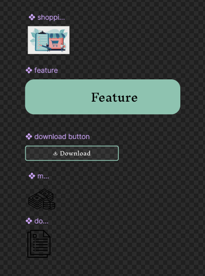
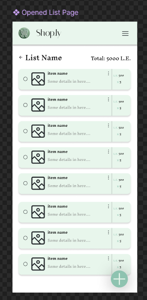
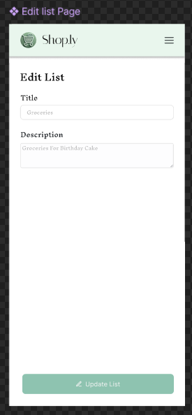

# Project UI Designs

<table>
<tr align="center"> <th>Design</th> <th>Link</th></tr> 
<tr align="center"> <td>Website</td> <td><a href="#Website">Link</a></td></tr> 
<tr align="center"> <td>Mobile App</td> <td><a href="#App">Link</a></td></tr> 
</table>

## Website

## App 

 
 
 
 
 
 
 
 
 
 
 
 

